# Information Visualization of Music Data

Sayyed Ahmad Hosseini

Zurich, January 2022

---

## Introduction

The purpose of this work is to practice data visualization, and hopefully gain some best-practices along the way.

The goal is to get insights from data on musicians, bands, albums, and the US music recording industry and create an eye catching and professional Graphic.

---
***DISCLAIMER***

The data provided for this lab work is collected and prepared by the author and is definitevely biased:

- by the data available at the time of acquiring it
- by the data that was available for free (Open Data)
- by personal music style preferrences

Any message deduced from this data does therefore not reflect universal facts but are only valid for the scope of the current data.

---

## Data Sources

The data on musicians, bands, and albums is sourced from the music database operated by Metason for their ArtistInfo application. Metason ([www.metason.net](https://www.metason.net)) is run by the author as a private project.

ArtistInfo is available as App for iOS and macOS as well as a Web front-end at [music.metason.net](https://music.metason.net). Detailed information for albums and artists is accessible as Web page via Universal URL (see samples below).

### Artists

- Famous musicians and bands
  - Data: [data/famousArtists.json](data/famousArtists.json)
  - Web: https://music.metason.net/famousArtists.html
- Data was collected in 2019 by Web crawling of
  - top100 lists of music community Web sites
  - unified with the information model of the Metason DB
- More details on Atists is available via
  - Universal URL: https://music.metason.net/artistinfo?name=`artist_name`
  - Sample URL: [https://music.metason.net/artistinfo?name=Radiohead](https://music.metason.net/artistinfo?name=Radiohead)
- `instrs` data field contains music instruments played by musician (as abbreviations, comma-separated, ordered, main instrument first, empty when is group)
- `genres` data field may have several (comma-separated) values which are sorted by relevance (main genre first).

### Albums

- Recommended albums
  - Data: [data/recomAlbums.json](data/recomAlbums.json)
  - Web: https://music.metason.net/greatRecords.html
- Data was collected in 2019 by Web crawling of
  - best-of lists from music community Web sites
  - top ratings of e-commerce Web sites selling music (e.g., Amazon)
  -  unified with the information model of the Metason DB
- More details on Albums is available via
  - Universal URL: https://music.metason.net/artistinfo?name=`artist_name`&title=`album_title`
  - Sample URL: [https://music.metason.net/artistinfo?name=Radiohead&title=Man%20Of%20War](https://music.metason.net/artistinfo?name=Radiohead&title=Man%20Of%20War)

### US Music Industry Revenues

Sales data from the Recording Industry Association of America (RIAA).

- 70 years of sales revenues by media, from vinyl to streaming
- Data: [data/USMusicMarket.csv](data/USMusicMarket.csv)
- Data Source from 1973-2020: https://www.riaa.com/u-s-sales-database/
- Data Source from 1950-1972: values are estimated from different sources
- Revenue values are in Millions USD (adjusted for inflation)

---

## Info Vis Process

Creating convincing Info Vis is typically an iterative process:

1. Data Processing
   - Data Acquisition and Extraction
   - Data Transformation and Cleansing
2. Information Modeling
   - Data Analysis
   - Visual Data Mining by creating data graphics
   - Back to step 1 to improve insights into data
3. Presentation Authoring
   - Story creation: open questions, interesting insights, messages, ...
   - Layout: chart type(s), dimensions, data mappings, ...
   - Styling: color palletes, typography
   - Text messages: title, subtitle, captions, annotations, highlights
   - Interactions & animations (optional, not for this lab work)
4. Back to step 1 or 2 to improve information visualization

### Album Data

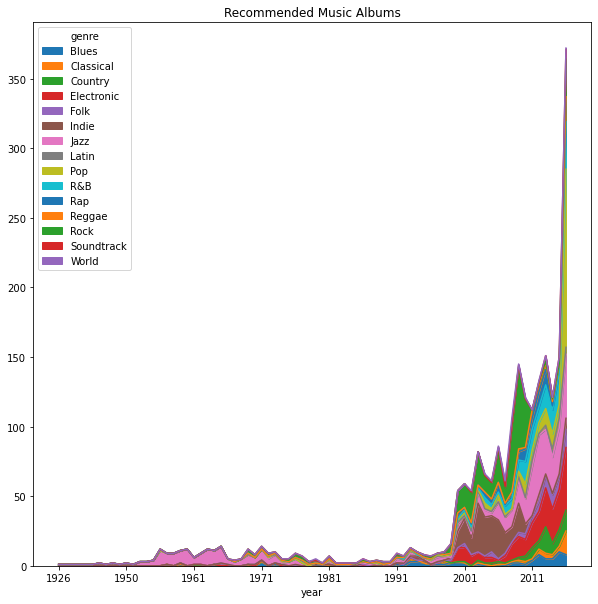

---

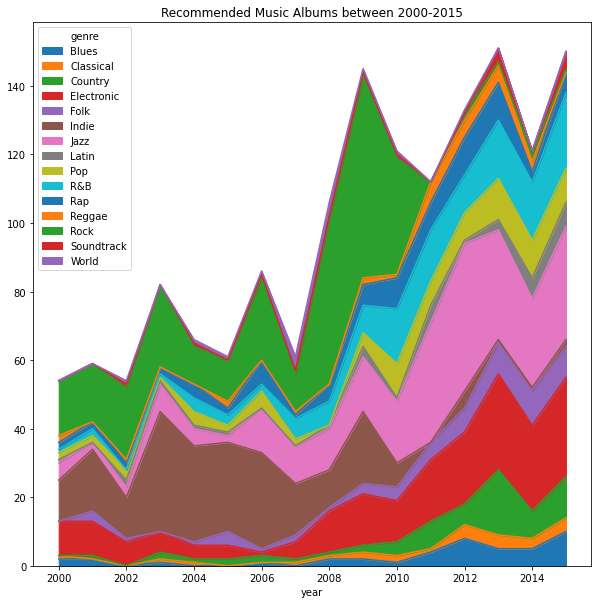

---

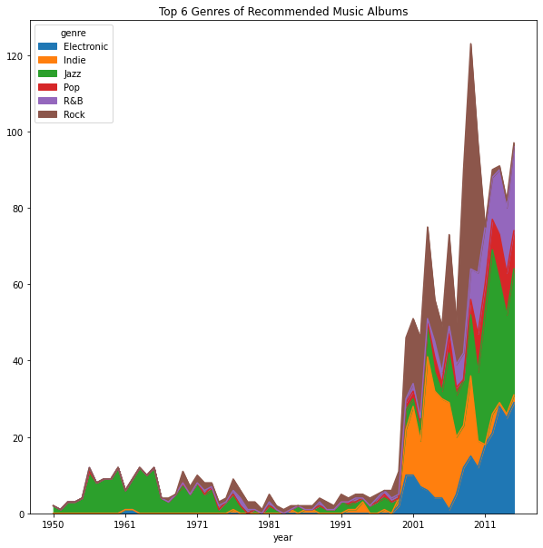

---

### Artist Data

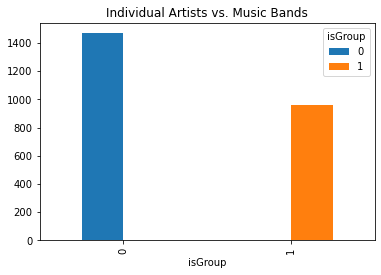

---

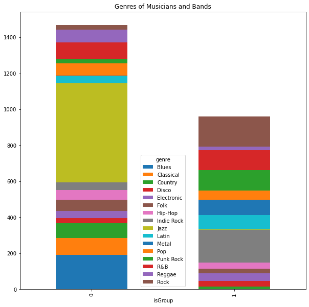

---

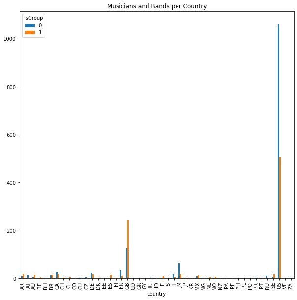

---

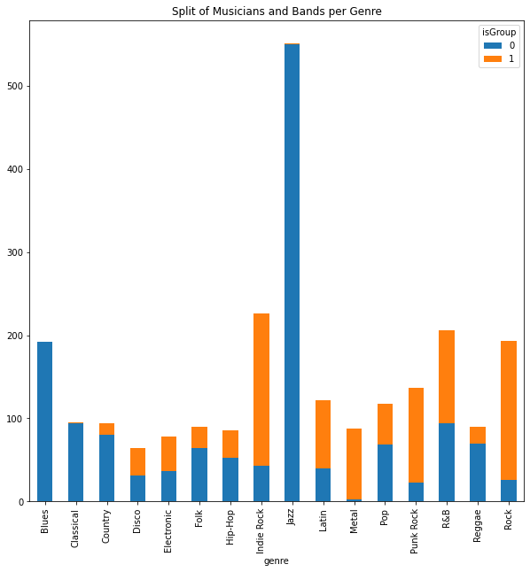

---

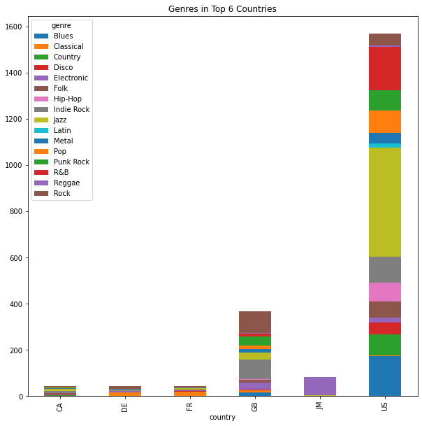

---

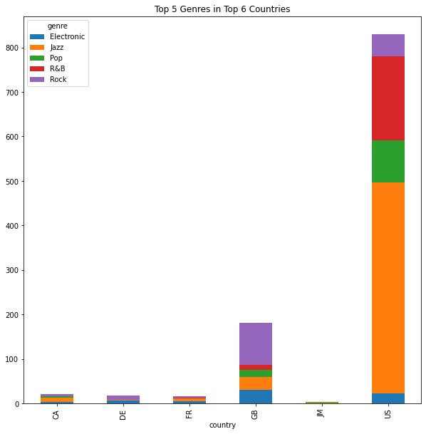

---

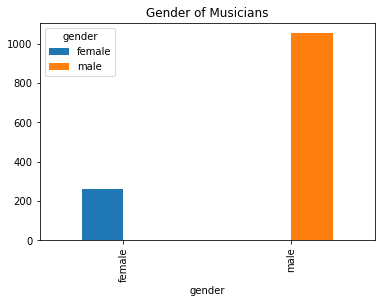

---

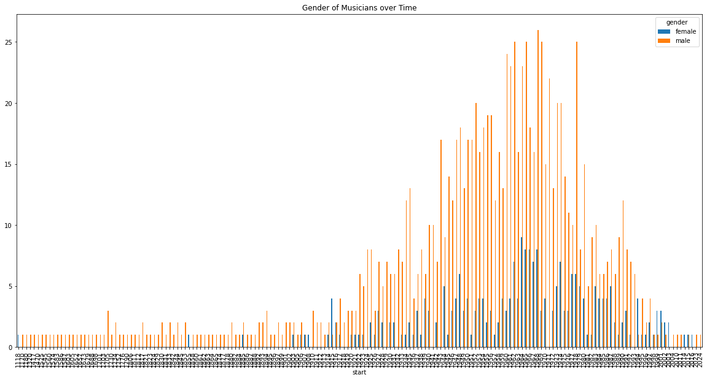

---

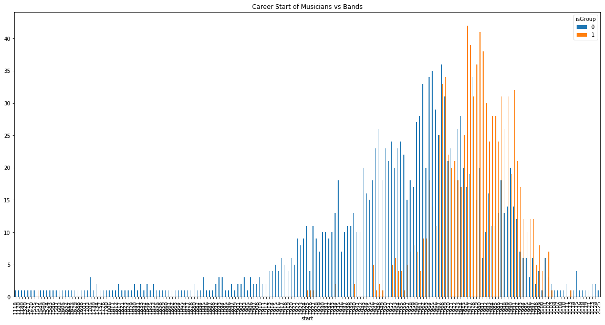

---

### My high quality Visualization

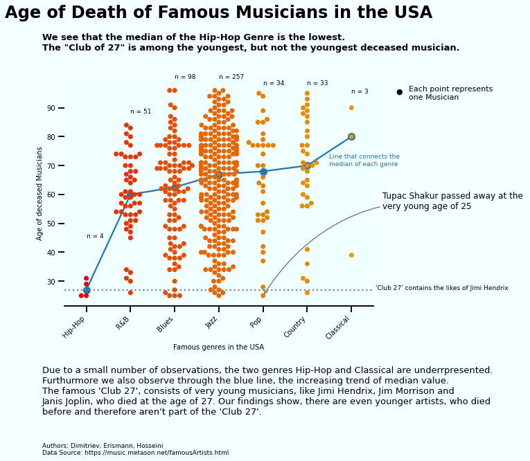

